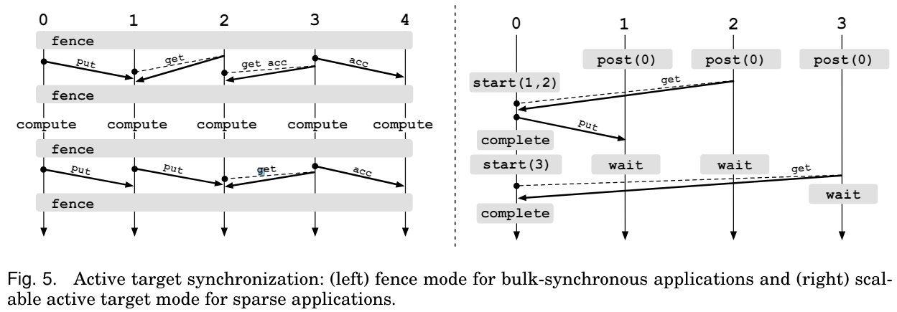

## 介绍

Remote Memory Accese（RMA）是MPI中的一种单边通信机制。具体来说，类似于cuda的统一内存，MPI划出了一块内存空间，称之为窗口（window），所有的进程都可以访问或修改这一块内存并且不需要显示的同步操作。

在下文中，我将遵循MPI标准中的定义，以源（origin）或源进程来指代调用RMA操作的进程，以目标（target）或目标进程来指代被访问内存的进程。

## 初始化

MPI提供了四种初始化函数，如下：

> **MPI_WIN_CREATE** 每个调用此函数的进程都会暴露一块已经被本地分配的内存。
>
> **MPI_WIN_ALLOCATE** 与上一个的不同在于，用户不需要提前分配好内存。
>
> **MPI_WIN_ALLOCATE_SHARED** 在上一个的基础上，其他进程可以直接读写window。
>
> **MPI_WIN_CREATE_DYNAMIC** 创建出的内存大小是动态的。

### MPI_WIN_CREATE

> MPI_WIN_CREATE(base, size, disp_unit, info, comm, win) 
> 
> IN base initial address of window (choice)
> 
> IN size
> size of window in bytes (non-negative integer)
> 
> IN
> disp_unit
> local unit size for displacements, in bytes (positive
> integer)
> 
> IN
> info
> info argument (handle)
> 
> IN
> comm
> intra-communicator (handle)
> 
> OUT
> win
> window object (handle)

其中，若`size`指定为`0`，则不会暴露内存。

`disp_unit` 为缩放系数，一般而言指定为`0`（不缩放）或`sizeof(type)`。（标准中说在异构环境下也可正确的缩放）。但是我在[其他教程](https://enccs.github.io/intermediate-mpi/one-sided-routines/#window-creation)可以看到代码中同时在`size` 和 `disp_unit` 中使用了 `sizeof(type)`。

不同进程创建的窗口在大小上可能是不同的，但是同一块内存可能映射到不同的窗口上。对重叠窗口的并发通信可能有未知的结果。

一个窗口可以在进程里的任意一块内存上被创建，但是，如果使用`MPI_ALLOC_MEM`来分配内存的性能表现会更好，在一些系统上使用字节对齐的内存也会有更好的性能。

### MPI_WIN_ALLOCATE

> MPI_WIN_ALLOCATE(size, disp_unit, info, comm, baseptr, win) 
> 
> IN size size of window in bytes (non-negative integer) 
> 
> IN disp_unit local unit size for displacements, in bytes (positive integer) 
> 
> IN info info argument (handle) 
> 
> IN comm intra-communicator (handle) 
> 
> OUT baseptr initial address of window (choice) 
> 
> OUT win window object (handle)

`size` 为0依旧是有效的。

对于`MPI_ALLOC_MEM` 和 `MPI_FREE_MEM` 的准则也对这个函数有效。（这里的准则指的是这块内存你需要手动释放，并且`baseptr`的类型是`*void`）。

可以在`info`中设置内存对齐参数。

### MPI_WIN_ALLOCATE_SHARED

>MPI_WIN_ALLOCATE_SHARED(size, disp_unit, info, comm, baseptr, win)
> 
> IN
> size
> size of local window in bytes (non-negative integer)
> 
> IN
> disp_unit
> local unit size for displacements, in bytes (positive
> integer)
> 
> IN
> info
> info argument (handle)
> 
> IN
> comm
> intra-communicator (handle)
> 
> OUT
> baseptr
> address of local allocated window segment (choice)
> 
> OUT
> win
> window object (handle)

这里分配的内存是连续的并且是根据内存的秩（rank）排的，除非你在`info`里指定了`alloc_shared_noncontig`。如果你指定了这个参数，那么库会优化共享内存碎片的布局，可能会优化性能。

如果使用了连续内存，那么只有第一个进程的内存会被对齐。如果没用，那么每一个进程的内存都会被对齐。

## 通信

所有的通信函数都是非阻塞的。

当源进程调用了一个同步过程或一个刷新过程时，操作结束。基于请求的操作会在源进程使用测试或等待（test or wait 我也不知道这是啥）过程时完成。

对于本地通信缓冲区的RMA操作只有在上一个操作结束后才会开始。

对于同一块内存的读写冲突会带来位置后果。但是同时的累加操作会顺利进行就好像他们是有序的一样。

你可以将`MPI_PROC_NULL`作为目标，但是依旧会用同步方法来关闭这个时期（epoch）

## 内存模型

在理解内存模型前，先提出两个概念：公有内存和私有内存。我们假设公有内存是所有进程都可以访问的内存，容量大。私有内存是每个进程独有的内存，访问快。对于不同的机器，这两块内存可能是一致的，也可能不是。一致的内存布局允许我们直接更新公有内存。而不一致的内存需要额外的RMA操作来更新公有内存。因此针对这两种情况，MPI提出了两种内存模型，分别为**RMA unified**和**RMA separate**，可以通过`MPI_WIN_MODEL`来设置。

### separate model

在这种模型中，每个变量在进程内存里都只有一个实例，但是对于每个窗口而言都有多个公有备份。对于本地内存的更新操作会影响到其他窗口的公有备份。对于私有备份的更新操作也会影响到进程内存。

### unified model

私有和公有拷贝是相同的，不需要额外的RMA操作，允许用户忽略一些同步调用并隐形的提高性能。

需要架构上的支持。

## 同步

RMA模型把通信分为了两种类型，如下：

> **active target communication** 直译就是积极通信，在这种通信模式下，源进程和目标进程都会显式参与通信，通信方法分别为`fence` 和 `SPCW`。
>
> **passive target communication** 消极通信，这种模式下只有源进程会显示的参与通信，通信方法为`lock` 和 `lock_all`。

### 时期（epoch） 

在介绍同步之前，先介绍时期这个概念。RMA模型中所有的通信操作都必须在一个时期中进行。需要目标进程通过同步操作来暴露时期（exposure epoch）和源进程也需要一个同步操作来访问时期（access epoch）。

### PSCW(Post-Start-Complete-Wait)

PSCW分别是四个不同的操作，目标进程使用Post的操作等价于打开一个暴露时期，而Wait等价于关闭这个暴露时期。源进程的Start则是打开一个访问时期，Complete 为关闭访问时期。
其具体流程用标准的一张图即可解释：

这种post必须在start前，wait必须在complete后的模式称之为强同步（strong synchronization）。但是强同步一般太理想化，所以如果不遵循这个顺序的情况，称此为弱同步（weak synchronization）。如下图

MPI允许弱同步模式。

### Fence

如果是在BSP范式下，编写PSCW显然十分封锁，但是我们还有另一个法宝——Fence！其差别和对比也可以用一张图来很好的表示（出自一位大牛的paper）

### Lock

这里的锁和我们一般在多线程中的锁很像，但是lock操作等同于打开一个时期，并不会建立一个临界区！锁分为排他的（exculsive）和共享的（shared）。排他锁同时之会允许一个进程访问，而共享锁允许其他持有共享锁的进程访问目标进程。

注意，两个源进程的顺序是不确定的！

如果使用锁，那么在时期内的所有RMA操作只会在解锁的时候完成，所以RMA在提供锁的同时，也提供了Flush操作，用来同步用。

## 参考

1. [eth_pdf](https://htor.inf.ethz.ch/publications/img/MPI_RMA_and_advanced_MPI.pdf)
2. [enccs](https://enccs.github.io/intermediate-mpi/one-sided-routines/)
3. [paper](https://htor.inf.ethz.ch/publications/img/mpi3-rma-overview-and-model.pdf)
4. [wgropp.34](https://wgropp.cs.illinois.edu/courses/cs598-s16/lectures/lecture34.pdf)
5. [wgropp.35](https://wgropp.cs.illinois.edu/courses/cs598-s16/lectures/lecture35.pdf)
6. [mpi-standard](https://www.mpi-forum.org/docs/mpi-4.1/mpi41-report.pdf)
