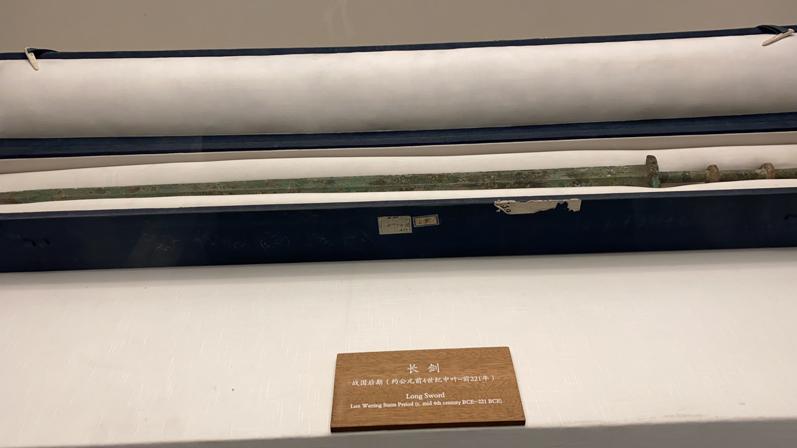
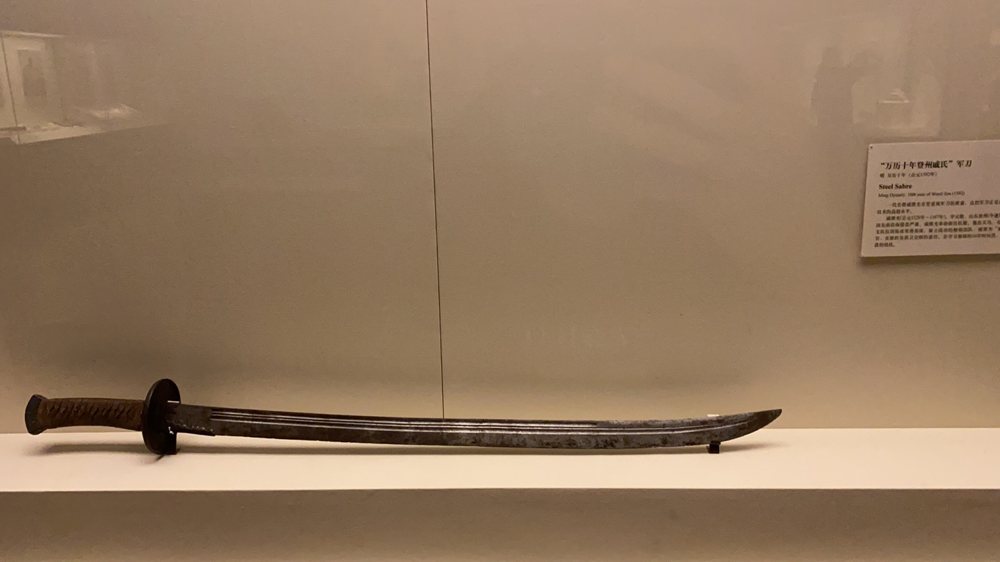
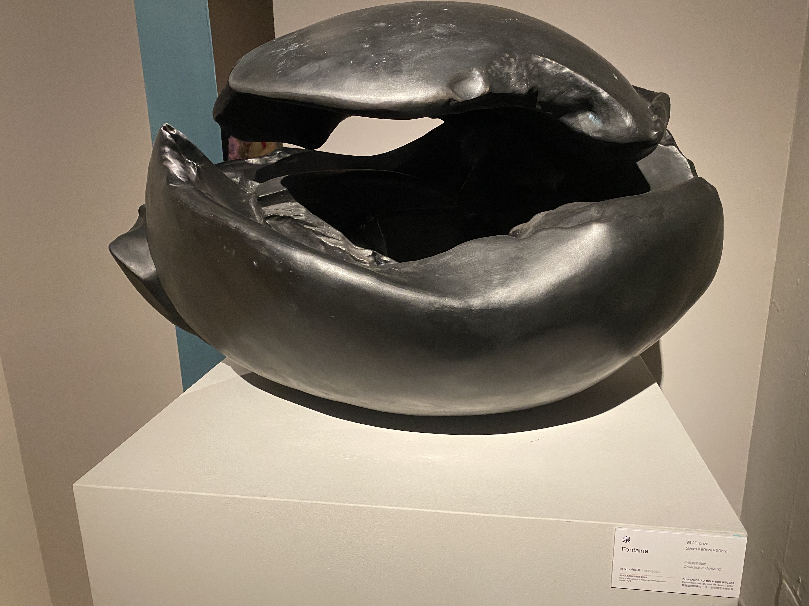
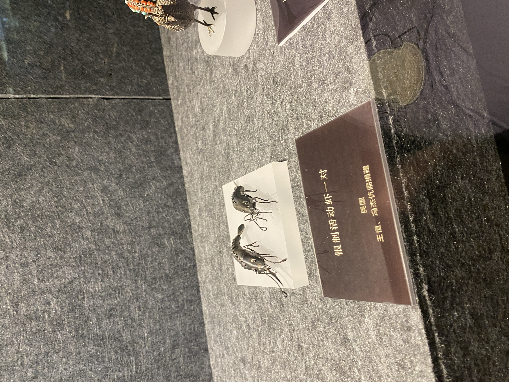
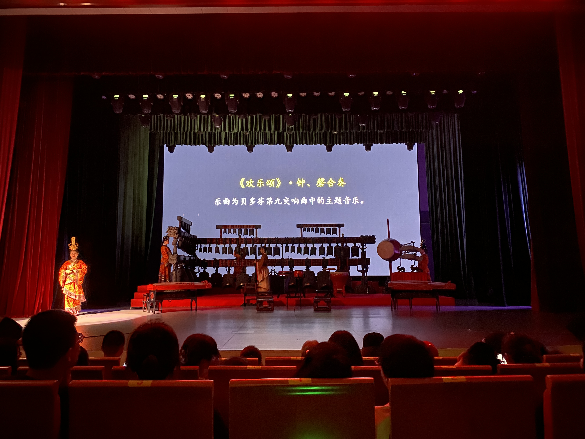
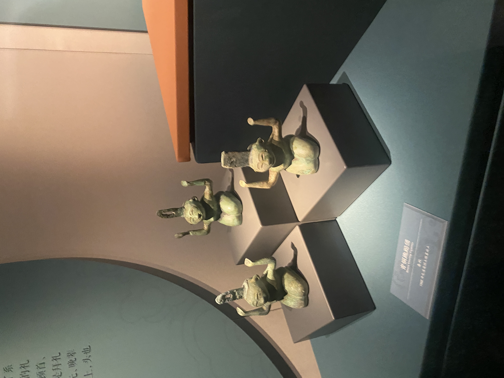

## 引

今天去了回安徽博物馆，感触颇多，感觉多少得写点东西。

在过去，我去博物馆的次数少之又少，第一是因为我读书生活时的城市几乎没啥博物馆，第二是我没怎么去外地旅游，去外地旅游时也没去博物馆的这个意识。但是我还是想回顾一下自己这么多年来所去的博物馆及其收获，以及这些博物馆的异同。

## 未成年阶段

我记忆中第一个去的博物馆应该是我小时去香港时旅游时所去的一个蜡像纪念馆？当然把一个十分钟就可以看完的纪念馆说成一个博物馆多少有些牵强。这个纪念馆是我去香港时在口岸中的一本香港旅游手册中看到的。但是等我兴冲冲的到达这个什么夫人的蜡像纪念馆后，才发现这个馆小的可怜，仅有的几个蜡像我也没多少印象了，那么在此略过罢了。

如果纪念馆不算博物馆的话，那我去的第一个博物馆应该是深圳书城旁边的一个博物馆，但是我忘记我具体是啥时候去的了，只记得自己是一个人去的。我对这个博物馆唯一的印象就是里面没多少东西，大抵讲了一下深圳这个小城市的历史，尽管深圳没啥历史可言。里面我唯一记得的一件展品就是一个明代的火铳，在此之前我一直以为火枪完全是欧洲传来的。

比起以上两个没啥东西的博物馆，倒是有另一个地方给了我不错的印象，那就是厦门的铁道文化公园。那是我去厦门玩时，走出了厦门大学却不知道去哪儿好时在地图上发现了这个地方然后顺便去的。里面有个隧道里有不少图框，在介绍铁道的同时还讲解的了厦门的历史。

## 北京

大一时去了北京玩，第一站自然是故宫...旁边的中山公园。如果把故宫算作博物馆的话，那么故宫的展品就是故宫自己。故宫很大，我也走的很累。所幸的是，我去北京的时候正值21年初，也就是正好疫情。所以北京各大景点的人都少的可怜。所以体验非常好。故宫中的珍宝馆里我记得有个可以写字的机器小人，其他就一概忘得差不多了。但是严谨来说，故宫里正儿八百放在玻璃柜里的展品也没多少。

上午去了故宫后，下午就去了故宫对面的国博了，国博里的东西确实多，严格来说国博是我第一个去的大型博物馆，而我也是刘姥姥进了大观园，涨了不少见识。第一次到大型博物馆的我此时还不知道博物馆原来还划分了不同的展区，不同展区的主题自然也不同。尽管是疫情期间，但是四羊方尊那儿还是围了不少人。四羊方尊所在的那个主题展厅介绍了中国的文化历史，从北京人到清朝。不少只能在历史课本上见到的东西在此处看到了实物，那是我在心里暗叹北京学生的幸福，不仅可以在周末来博物馆切实体验历史的厚度高考难度还低。这大抵就是国博给我的最深的感受吧。

国博之后便是军博。坦白而言这个军博给我的印象远比国博深刻，因为我来之前以为军博可能就像红军宣传片？但是军博里面不仅介绍了从古至今的武器发展，还有大量的现代兵器，各种枪械囊括中外。地下甚至还有坦克大炮。我至今依旧记得脚下那架战斗机的残骸。我后来听到别人要去北京时都会告诉他：一定要去一趟军博！

那段时候我还去了一个叫红砖美术馆的地方，里头有不少现代艺术作品，其中有一个房间中吊着不少东西，这是我唯一还记得的里头的艺术品。那应该是我去的第一个美术馆，但是里面的东西太少，又太现代，门票要一百多大洋，感觉有点亏。

后来随着疫情越发越收紧，我再也没出去旅游。等到放开的时候，我又很不幸的要准备考研，在这个期间自然就没去其他博物馆了。考研结束后的那个寒假，mygo里的两个成员会出席北京的一个漫展，于是我又一次去了北京。这一次我去了北京的美术馆看了看，里头有雕塑展和画展。这是我第一次去正经的美术馆。也许感受到了一些美学的熏陶？

除了北京美术馆，我还去了一趟清华的艺术博物馆。馆内也多少介绍了一下清华的历史及其著名校友。有一个展子的展品是3d打印的艺术品，在观看的时候我一直在想这玩意是如果做到在打印的时候不塌的。还有个展子展出了一些特别的画，与其说是画不如更像是浮雕，作者使用大量的油墨在画布上营造出了一种立体的效果。四楼有个康有为的个人生平展（也有可能是梁启超，我老是把这两个弄混）在观展的时候我老是在想这个人后面是不是反对辛亥革命的墙头草，但展子也没提这一档子事。还有几个展子介绍了家具和印章文化。也是在这个时候我才知道制章者会在自己做的印章上留下些自己的痕迹来表明这个印章是自己刻的。最后还有一个小展子要额外的门票，我钱不多，就没去看，清华艺博对于清华的学生免费我多少可以理解，但是对于清华附中的学生也是免费的，让我感叹人世的参差（后来我朋友告诉我附中的人的饭卡甚至在清华内部刷）。看完展子我还去和我在网上认识的一个网友面基，这是我第一次和网友线下见面。进了清华艺博后可以直接去清华校园内部，不需要预约，算是清华大学的一个bug，关于清华大学还有一个神奇之处，清华食堂负一楼的一家披萨食堂使用手机点菜，但是点完之后只会有一个报错界面，朋友告诉我这就算成功了，着实草台。

## 广州

在回家的路上，我顺道去了下广州玩了下。目的地自然也就是各类博物馆和美术馆了。时间紧迫所以只去了南越王博物馆，这个博物馆有两个分馆，一个分馆在介绍墓穴的基础上还介绍了一下广东的历史，那时我也才知道以前广东可以算作南蛮之类，在古代的分量可能没那么重，但是广窑也有出厂自己的特色瓷器。另一个分馆不仅在展出墓穴发掘物的同时还展出了香港富商的捐赠的私人收藏漆器。汉代的漆器大多只有红黑二色，但是红黑二色确实好看。

回家后，大学同学要来广东看fgo的一个嘉年华，我就也去了一趟广州再玩几天。那是和同学一起去了十三行博物馆。那是我第一次与其他人结拜去博物馆，截止至目前也是唯一一次。博物馆展出了明朝后广东作为全国海关时的贸易状况，政策施行，以及一些当时的贸易品。展品不少都有西方风格，朋友赞叹不已，然而我只觉得朋友吵闹。

后面又去了广东美术馆，那次展览里有闽南的竹楼建筑，也是我第一次在美术馆内看到建筑 ，里头的不少现代的展品我虽然多少看不懂，但是多少也能从中体会到作者对于当下时代的一些无声锐评。美术馆内的展品不一定对口味，但是能让人少一些对于现代的或后现代艺术的偏见。

美术馆对面是广东华侨博物馆，里面的展品大多来自广东华侨的捐赠，介绍了老广人去东南亚和美国打工的历史，以及这些人在多年建国后或改革开放后依旧想着回国的故事。当时还有一个特别展览，介绍抗日战争时期美国飞虎队的故事。然而尽管介绍了老美的国际主义精神，但是并没有提及为啥国军的空军力量如此薄弱。

最后一站中山纪念馆，里头介绍了孙中山一生的生平，也介绍了广东在近代时的革命历史。也就是在这我才知道原来孙中山曾经差点信了基督教。在此之前我一直听说孙文是国父，却不太清楚他具体干了啥。现在才知道他以前也是学医的，后来为革命筹钱而奔走四方，几次革命的失败与再次革命也是这个时候才了解。

综合来说，广东的南越王博物馆补全了广东古代的历史，十三行博物馆和孙中山纪念馆补全的近代的历史，华侨博物馆也在一定程度上介绍了当代的历史，都是非常值得一去的博物馆。

## 武汉

后来考研复试失败，我原本的旅游计划全部都被替换成了求职找工作，毕业后没回家直接就去了公司入职。入职后的第二周，我去武汉听惘闻的演出。于是顺道也去了武汉的博物馆和美术馆。

我到武汉博物馆时已经快四点了，而博物馆五点闭馆。这点时间看不了啥，于是我买了张编钟演出的票，不得不说除了最后的用编钟演奏命运交响曲有点不伦不类之外，其他曲目都非常不错。我也是此时才知道编钟的演出不是只有一个人在敲。底部有个最大的编钟自始至终也没有被敲响过，也不知如此之大的种对应的是哪个音。演出结束后已经是四点半，我去了二楼摆放越王勾践剑的地方看了看，那个展品被围得水漏不通，保安在现场怒吼要人们不要拍照，看完快走。我挤不进去，故没能一睹此剑的风采，非常遗憾。

第二天本想再去一次武汉博物馆，但是没有预约，周天当天预约是没有票的。所以只能去了武汉博物馆旁边的武汉美术馆。美术馆的一楼展示了漆画，漆画有点像漆器，大多数画都是使用大色块组合而成，说实话还挺好看。二楼展示的比较杂，没有明确的品类。四楼有个介绍武汉自辛亥革命后的美术发展了历史，非常有意思。

去玩美术馆后还有一个中午的时间，我就顺道去了趟江汉关博物馆，江海关博物馆很像广东的十三行博物馆。武汉历史上也是中国被迫开放的口岸，但是无论进口还是出口都比不上另外三个大港口（沪津广），博物馆内展品虽没十三行华丽，但是装饰不错，对于革命历史的介绍也比十三行详细不少。

## 安徽

安徽博物馆也分旧馆和新馆。我第一次去博物院的时候，看到旧馆更近一些，就先去了旧馆。旧馆虽然外观看上去有些破旧，但是里面却意外的干净整洁。因为去的时候时间比较晚了，我也只参观了两个展区，一个是关于安微的红色革命历史，安徽作为红军早期的活动地带，而且也是淮海战役的主战场。关于这方面的资料远比以前所看的博物馆都要详实。在介绍战争的时候有一本日本人写的书，题目里有支那二字，但是大部分人似乎还不太了解这两个字是对于我国的蔑称。另一个展馆介绍了安徽的地理环境和中国古代和现代对抗黄河泛滥而做出的大量努力。这种改造山海的精神对我来说很是震撼。参观的时候我甚至在想这种大修水利和基建的举动能不能做到游戏里。

一周过后我又去了新馆。进安徽博物馆需要排一个非常长的队，这是因为博物馆需要安检导致的，无可厚非。馆内的导引上说安徽的历史文化占了四个展厅，但是第四个展厅实际上展出的是一个星空主题展。三个展区分别介绍了原始社会、夏朝到汉朝，汉到明朝。可是并没有近代史，也许是因为这一部分在旧馆的缘故。安徽博物馆之行给我最大的感触莫过于，安徽在古代估摸也是个不错的地方，这片土地的历史和故事远远大于广东和北京，楚国的历史、徽商的富有、安徽祭祖文化，中都、文房四宝皆是安徽特产都使我对这片土地有了更加深刻的印象。同时馆内还有一个希腊文化展，但是这个展子也是需要额外买票，而且一开始也需要排队一个小时，所以我就没去。

我后来有去了一趟新馆，特意看了一下希腊的展子。不知道为什么，感觉里面的展品都特别新，但是说明并没有说是复制品，雕像并没有保护措施，很难想象这些雕像是几千年前的，同时期中国的文物都是破破烂烂的，这还是修复后的样子。

安徽美术馆里展出的大部分都是些画作，我更喜欢现代的画作，有一种莫名的张力。

## 杭州

中秋节的时候去了趟杭州，只去了杭州美术馆，里面有一些现代艺术展品，展出的形式非常新颖，比如游戏、影视和实物。还有齐白石的个人展。在看个人展的时候，我在思考：如果齐白石的家属找人画一幅画，声称这是齐白石生前画的，然后拍出齐白石作品的价格，会如何呢？这中行为甚至在齐白石自己也可以这么干。

## 上海

第一次去上海时，先是去了鲁迅纪念馆，很小的纪念馆，在鲁迅公园里面，介绍了鲁迅的事迹和生平，还展览了一些信件。但毕竟只是个个人纪念馆，体量有些小。

上海美术宫是印在课本上的标志性建筑，肯定得去看看。展出的内容和传统的美术馆差不多，但是具体展出了啥我也忘记了。

这天的最后一点时间去了上海当代艺术博物馆，这个馆看上去大，实际上展出的内容少的可怜，但是展出的东西都挺有意思，有稀奇古怪的小电影，有类似《泉》那样的实物展品。

第二次来上海的时候，和朋友去了水族馆和世博会博物馆。水族馆非常漂亮，就是人有些多，在海底隧道那儿比较挤，有企鹅和海豹，可惜没有北极熊。世博会博物馆这种主题展览我非常喜欢，不仅中西结合，还把历史上的重要发明也顺带讲了一些。

第三次来上海时去了上海博物馆东馆和船舶博物馆，东馆这种不需要预约的机制很好，但是里面展出的还是太泛泛了，里面有一个货币的展览很不错，但是其实伴随着货币的历朝历代的一些经济改革也可以顺便提及一下，比如在介绍交子的时候可以插入的介绍王安石变法在经济上的措施，但是没有。十分可惜。

船舶博物馆在一个非常偏远的地方——临港新城，去这地方最快的办法就是坐大班车——一种一小时一班的地铁。为了赶最近的大班车我和朋友不得不提前结束在东馆的游览，撒开脚丫子跑向地铁站，最后勉强赶上了。然后在大班车上又站了快一个小时。我对船舶博物馆的期望是像北京的兵器博物馆一样，但是实际上船舶博物馆对战舰的着墨并不多。更多的是中国造船的历史、航运的一些科普、以及在角落的几个战舰模型，甚至不是最新的模型，对此我比较失望。

## 南京

## 结语

至此为止，我也算是一个小小的博物馆爱好者了，可以说我去一个城市都会优先去他的博物馆。逛了这么多博物馆，有时候我会发现一些博物馆会把自己的展品送去其他地方参展，甚至北京的美术馆内就会借其他省份博物馆的展品，但是北京博物馆自己的展品却少有外出的时候，令我再次感慨世界的参差。