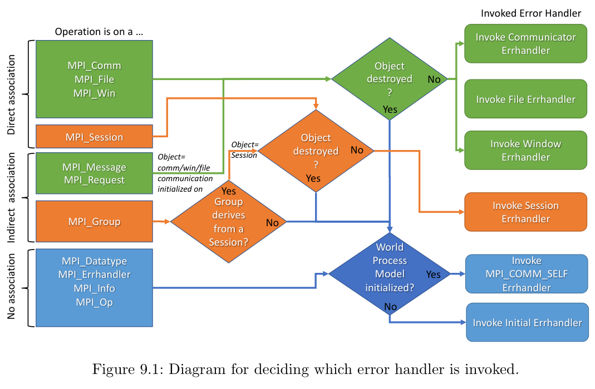

MPI的标准中认为标准规定的数据的传输都是可靠传输，不需要规定如何处理错误，有些实现可能会有不可靠传输机制，错误的处理就由具体的实现来处理。但是各种由于其他方面引起的错误依旧客观存在，所以标准中依旧规定了一些错误码的种类并且允许用户自己实现错误处理。

前排提醒，文中的所以函数只是标准中约定的函数，实际需要调用的函数根据所使用的语言可能有所不同，请以标准和实现为准。

## Error Handing

MPI中用户可自定义的错误处理函数可以分为四种类型，分别为`Communicator` `Windows` `Files` `Sessions`。其错误发生的操作和所调用的函数之间的关系如下：

MPI还提供了三种错误处理函数，如下

> **MPI_ERRORS_ARE_FATAL** 调用它会终止所有的进程，等效于一个有着所有进程的通讯器调用MPI_ABORT，且MPI_ABORT的错误码都是由实现指定的。（这里可能读起来有点拗口，但是笔者不太会翻译英语长句，可以参考具体标准文档）
>
> **MPI_ERRORS_ABORT** 如果在Session内调用，之会在本地进程内终止。在其他情况下会终止其相关通信器的进程。其错误码也是由具体实现指定。
>
> **MPI_ERRORS_RETURN** 返回错误码，但是不做其他事。

实现一般会提供其他错误处理函数。但是在一般情况下，`MPI_ERRORS_ARE_FATAL`是默认的错误处理函数。

用户可以使用 `MPI_XXX_CREATE_ERRHANDLER` `MPI_XXX_SET_ERRHANDLER` `MPI_XXX_GET_ERRHANDLER` `MPI_XXX_FREE_ERRHANDLER` 来创建、设置、获取和释放回调函数，其中 `XXX` 为`COMM` `WIN` `FILE` 或 `SESSION`。值得注意的是，回调函数在MPI里是一个不透明对象，对于用户而言是不可见的，只能用句柄来访问。

## Error code and class

有关错误码具体含义完全由具体实现来决定，除了`MPI_SUCCESS`，他的值默认为0，含义显而易见。

尽管标准没有给出具体的错误码，但是便准由一系列错误类（Error Class），规定了不同种类的错误。或者说，错误类就是最基础的错误码。一个错误码可能属于不同的错误类，可以使用 `MPI_ERROR_CLASS` 来把错误码和错误类关联起来。所以错误码需要遵循以下约束：

$$
0 = MPI\_SUCCESS < MPI\_T\_ERR\_XXX \leq MPI\_ERR\_LASTCODE
$$

## 如何做呢

那么在MPI中处理错误，我们已经有了一个清晰的路线：

1. 自己定义一个错误类。
2. 把你想要错误码和错误类关联起来。
3. 给你的错误吗添加描述。
4. 移除联系（标准是这么写的，移除啥联系标准也没说，我认为是默认的错误处理函数与你定义的通信器之间的联系）
5. 使用你自己的错误处理函数。

## 参考

[mpi-standard](https://www.mpi-forum.org/docs/mpi-4.1/mpi41-report.pdf)