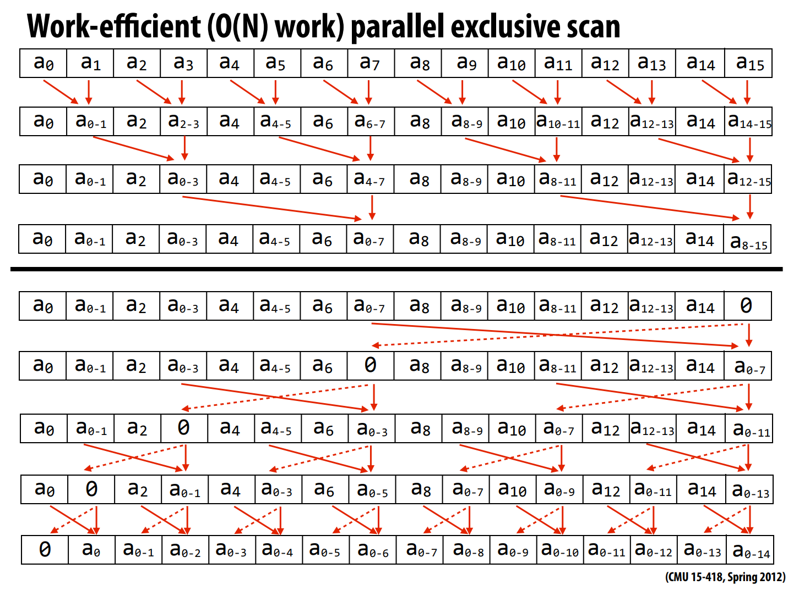

cmu15418在2012年的课程里还有讲这个算法，但是现在我在他的课程大纲上已经看不到这个算法的讲解。
国内外关于这个算法的资料大多数也是少的可怜。故作此文。

前缀和一般有两种形式，一种在计算时会加上当前的元素（inclusive），另一种则不会（exclusive），本文所述皆为后者。

本文为简便起见，皆使用openmp的方式并行。

## 基础前缀和

### 串行

```cpp
template<typename T, class OP>
void exclusive_scan_seq(T* a,T init, size_t n, OP op){
    T tmp = a[0];
    a[0] = init;
    for(int i=1;i<n;i++){
        T t = a[i];
        a[i] =op(tmp,a[i-1]);
        tmp = t;
    }
}
```
很简单，没啥好说的

### 并行


```cpp
template<typename T, class OP>
void exclusive_scan_par(T* a,T init, size_t n, OP op){
    int offset=1;
    for(;offset<(n>>1);offset<<=1){
        #pragma omp parallel for
        #pragma unroll 
        for(int i =n-1-( offset*3 );i>=0;i-=offset<<1){
            a[i+offset] = op(a[i],a[i+offset]);
        }
    }
    a[n-1] = init;
    for(;offset>0;offset>>=1){
        #pragma omp parallel for
        #pragma unroll 
        for(int i =(n-1)-offset;i>=0;i-=offset<<1){
            T temp = a[i];
            a[i] = a[i+offset];
            a[i+offset] = op(a[i+offset],temp);
        }
    }
}
```

程序的前半部分我称之为前向传播（在论文原文中为up-sweep），后半部分我称之为反向传播（down-sweep）。

cmu15418的ppt给的配图里的数组长度刚好为2的幂次方，但是如果数组不为2的幂次方，那么情况会有些许麻烦。
想要理解算法的全过程，可以试着先理解反向传播，在去看正向传播。因为我们不难注意到：初始值是在反向传播的过程中才开始被加入到数组中的。
而根据前缀和的定义，在反向传播的过程中，这个初始值势必会传播到数组上的所有位置。记住这一点，反向传播的过程就好理解多了。

我们不难发现，数组的最后一个元素实际上不影响后续的操作，因为反向过程会把数组的最后一个元素设置为初始值，所以我们可以略过最后一个元素。

尽管他的复杂度也为$O(n)$，但是根据实际测试（openmp的线程数设置为16），其所消耗的时间依旧比串行版本更久，
查看编译器生成的汇编后发现，并行版本的前缀和每次循环所需要的指令比串行版本的多的多，而且编译器不会自动做向量化处理。
通过perf工具还会发现并行版本对cache的访问次数是串行的十倍左右，而且局部性也不太好。

## 分段前缀和

相比传统前缀和，我们额外增加了一个`flags`来把数组分成大小不同的几段，用`1`来表是一个段的开始，`0`来表示处于一个段中。
一般来说，`flags`的第一个元素为`1`。
### 串行
```cpp
template<typename T, class OP>
void exclusive_seg_scan_seq(T* a,int* flags,T init, size_t n, OP op){
    T tmp = a[0];
    for(int i=0;i<n;i++){
        if(flags[i]){
            tmp = a[i];
            a[i] = init;
        }else{
            T t = a[i];
            a[i] =op(tmp,a[i-1]);
            tmp = t;
        }
    }
}
```

### 并行


```cpp
template<typename T, class OP>
void exclusive_seg_scan_par(T* a,int* flags,T init, size_t n, OP op){
    int offset=1;
    int fb[n];
    for(int i=0;i<n;i++){
        fb[i] = flags[i];
    }
    for(;offset<( n>>1 );offset<<=1){
        #pragma omp parallel for
        #pragma unroll 
        for(int i =n-1- ( offset*3 );i>=0;i-=offset<<1){
            if(!flags[i+offset]){
                a[i+offset] = op(a[i],a[i+offset]);
                flags[i+offset] |= flags[i];
            }
        }
    }
    a[n-1] = init;
    flags[n-1]=0;
    for(;offset>0;offset>>=1){
        #pragma omp parallel for
        #pragma unroll 
        for(int i =(n-1)-offset;i>=0;i-=offset<<1){
            T temp = a[i];
            a[i]= a[i+offset];
            if(fb[i+1]){
                a[i+offset] = init;
            }
            else if(flags[i]){
                a[i+offset] = op(init,temp);
            }else{
                a[i+offset] = op(a[i+offset],temp);
            }
        }
    }
}

```
这个代码我虽然无法完全理解，但是他运行的结果和串行版本一致，[ 源码在此 ](https://github.com/Woodman3/hpc_algorithm.git)，如果有纰漏的情况还请指出。

在课程的ppt中，可能是默认初始值为0的缘故，反向的过程有些bug，毕竟在初始值为0的情况下，`+ 0`和啥也不写没区别。

前向过程很好理解，因为flags如果不为0,那么我们可以肯定这一次求和会涉及到其他段。

在反向过程中，我们每次都操作都像是在修改一颗树上的两个节点，于是我们把`a[i]`称为左节点，`a[i+offset]`称之为右节点，以便理解。

如果在一次求和中，如果左节点恰为他那个段的最后一位，那么他的值显然是不被右节点所需要的，且此时的右树不需要其他多余的值，那么我们直接给右节点赋予初始值即可。这就是第一个if的目的。

如果左节点的flags为1,那么这意味着他在前向过程中已经积累了它所处的段到他这个节点的所有累加的值，这个值有可能被他后面的节点所用到，
而他后面的节点正好在右节点的子树中，我们需要把他的值与初始值相加以传递给左节点后面的节点。
而我们在第一个if中已经排除了他是本段最后一个节点的情况。

如果左节点的flags为0,意味着左树只是他所在段的一部分，而在他的前面还有段的其他部分。
他的段的其他部分在上一次的后向过程中已经被存在了右节点中，故我们需要把他与右节点相加。


## 参考

1. [cmu](https://www.cs.cmu.edu/afs/cs/academic/class/15418-s12/www/lectures/24_algorithms.pdf)